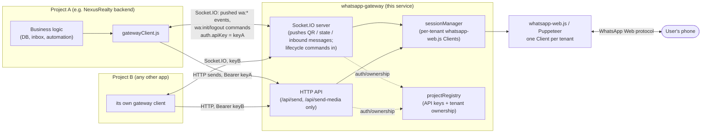
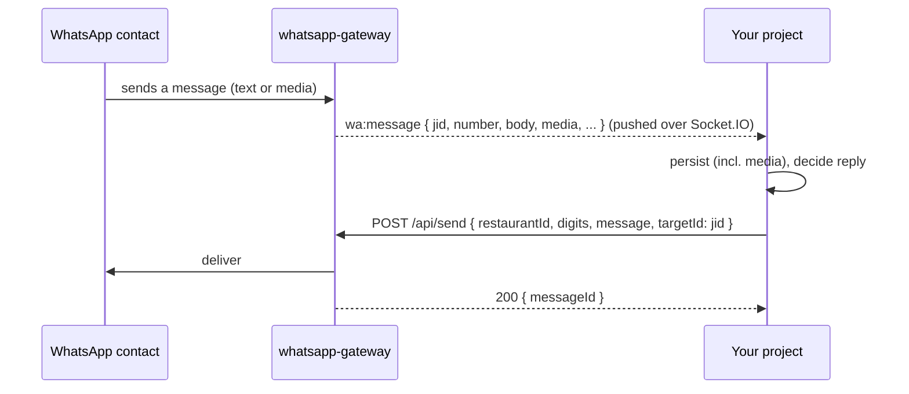

# whatsapp-gateway

Standalone service that owns all `whatsapp-web.js` / Puppeteer code for WhatsApp integration. Multiple independent projects (e.g. the NexusRealty backend, the Dinera backend, any other app) can share one gateway instance, each managing its own tenants without seeing or touching each other's sessions.

## Responsibilities

The gateway does exactly three things:

1. **Generate the QR** that links a tenant's WhatsApp, and push connection state (`initializing` → `qr_ready` → `connected` …) as it changes.
2. **Send** text and media messages on request.
3. **Receive** — push every new inbound message, **with its media attached**, to the owning project over its socket, the moment it arrives.

It never serves anything to fetch or poll: no message history, no chat lists, no status endpoint, no media downloads. Projects keep one socket open and react to what's pushed. There's no business logic or storage either — no database, no auto-reply, no message history. That all lives in each consuming project (for NexusRealty: `backend/services/whatsapp/whatsappService.js`).

Sessions persist on disk (`LocalAuth`, `.wwebjs_auth/<tenantId>/`) so a restart doesn't need a re-scan. A tenant is any id your project uses — e.g. an organization id — or `null` for a project's platform number (`__platform__`).

## Architecture



Projects are fully isolated: each only ever receives events for tenants **it** owns, enforced by `projectRegistry` on every socket command, socket event and HTTP call.

## Multi-project routing

Each connecting project authenticates with its own **API key**, defined in `projects.json`:

```json
{
  "nexusrealty-backend": { "apiKey": "..." },
  "dinera-backend":      { "apiKey": "..." }
}
```

(copy `projects.json.example` to get started — `projects.json` is gitignored since it holds secrets)

The first time a project calls `wa:init` for a given `restaurantId`, the gateway **claims** that tenant for that project (persisted in `.tenant-ownership.json`). From then on:

- Every event for that tenant is only ever delivered to that project's own socket connection(s).
- A send or socket command for that tenant from a *different* project's API key is rejected (`403 Tenant is owned by another project.` over HTTP, a `wa:error` over Socket.IO).
- `wa:logout` releases the claim.

Tenant ids only need to be unique **within** a project — but since the first claim wins, two projects must not use the same raw id. Ids like Mongo ObjectIds are globally unique in practice; otherwise prefix them (`"<projectId>:<id>"`).

If `projects.json` doesn't exist, the gateway falls back to a single legacy project named `default` using `GATEWAY_SHARED_SECRET`.

## Transport

| Channel | Direction | Carries |
|---|---|---|
| **Socket.IO** — gateway = server, you = client | gateway **pushes** → you, and your commands → gateway | pushed: `wa:qr`, `wa:status`, `wa:message`, `wa:error` · commands: `wa:init`, `wa:set-subscribers`, `wa:logout`, `wa:destroy` |
| **HTTP** — `/api/*`, bearer-authed | you → gateway | `POST /send`, `POST /send-media` — nothing else |

Everything the gateway knows reaches you by push, in the order it happened, on the one socket. There is no endpoint to poll — if you need something later (a message, its media, the last status), store it when it's pushed. Every call/event takes a `restaurantId` (`null` = the project's platform tenant).

### Connecting

```js
const { io } = require('socket.io-client');

const socket = io('http://localhost:4100', {
  auth: { apiKey: process.env.WHATSAPP_GATEWAY_API_KEY },
  reconnection: true,
});
socket.on('connect_error', (err) => console.error(err.message)); // "unauthorized" = bad key
```

Open this **once per process** at boot and keep it open. The gateway itself restores every tenant it has previously seen when *it* restarts (see below), so most of the time nothing more is needed — but also emit `wa:init` for each tenant you expect to be connected on every (re)connect of your own (with `hasSubscribers: false` — see below), to cover the case where the gateway stayed up but your process restarted or lost its connection: the gateway resumes it (or, if already running, just re-pushes its current `wa:status`), so you're back in sync either way. `wa:init` is idempotent — calling it for a tenant that's already connecting/connected is a no-op that just re-sends its current state. Note that socket.io-client does not auto-reconnect when the *server* closes the connection (`reason === "io server disconnect"`) — call `socket.connect()` yourself in that case.

### Restoring sessions on a gateway restart

On its own boot, the gateway walks every tenant claimed by any project (`.tenant-ownership.json`) and resumes each one automatically — no project needs to ask for it. A tenant whose saved session is still valid resumes straight to `connected`; one whose session expired server-side would otherwise produce a QR nobody's watching, so it's torn down instead and reported `disconnected` (`wa:status`) — the owning project's UI prompts a fresh scan, same as any other unwatched QR. This only requires `.wwebjs_auth/` and `.tenant-ownership.json` (or their `WWEBJS_AUTH_PATH`/`TENANT_OWNERSHIP_FILE` overrides) to be on persistent storage — see [Notes](#notes).

### Connect / QR scan flow

```mermaid
sequenceDiagram
    participant UI as Your admin UI
    participant You as Your project
    participant GW as gateway (Socket.IO)
    participant Phone as User's phone

    UI->>You: click "Connect WhatsApp"
    You->>GW: wa:init { restaurantId, hasSubscribers: true }
    GW-->>You: wa:status { status: "initializing" }
    GW-->>You: wa:qr { qr: "data:image/png;base64,..." }
    You-->>UI: render QR image
    UI->>Phone: user scans QR (Linked devices → Link a device)
    GW-->>You: wa:status { status: "authenticated" }
    GW-->>You: wa:status { status: "connected", isReady: true, clientInfo }
    Note over GW,You: from now on, every inbound message is pushed as wa:message
```

A fresh `wa:init` can take 15–30 seconds before the first `wa:qr` (Chromium cold start). WhatsApp rotates the QR roughly every 20 seconds — each rotation is a new `wa:qr`.

### Abandoned QR codes don't run forever

If nobody scans the QR, the gateway doesn't keep rotating and pushing it (or holding a Chromium instance open) indefinitely. `QR_EXPIRY_SECONDS` (default 120) is a total budget starting from the *first* `wa:qr` of a session — once it elapses without a scan, the gateway tears the client down on its own and reports `wa:status { status: "expired" }`, distinct from a plain `disconnected` so your UI can say "that code expired" rather than implying an existing link broke. The tenant is unclaimed again as far as the client goes (though ownership stays claimed — see above); a later `wa:init` starts clean with a brand-new QR.

### Commands you EMIT (→ gateway)

| Event | Payload | What it does |
|---|---|---|
| `wa:init` | `{ restaurantId, hasSubscribers? }` | Creates (or re-pushes the current state of) a tenant's client — resuming its saved session if there is one. Idempotent. **Claims the tenant** on first call. |
| `wa:set-subscribers` | `{ restaurantId, hasSubscribers }` | Whether anyone currently wants this tenant's QR. While `false`, a QR that fires is discarded and the client torn down (reported as `wa:status disconnected`), so an unscanned session doesn't hold a Chromium open. This is the *explicit* signal ("the UI panel closed"); `QR_EXPIRY_SECONDS` below is the backstop for when nobody ever sends it. |
| `wa:logout` | `{ restaurantId }` | Unlinks the device on WhatsApp's side (it disappears from the phone's *Linked devices*), destroys the client, deletes the saved session, and releases your ownership claim. Next connect needs a fresh QR. |
| `wa:destroy` | `{ restaurantId }` | Destroys the client but **keeps** the saved session — for a transient stop where you expect to resume. |

A command targeting a tenant owned by another project emits you a `wa:error` instead.

> **Always pass `hasSubscribers: true` on a user-initiated `wa:init`.** Never compute it from your own connection/room state at that moment — if that state isn't settled yet it comes back `false`, the first QR is silently discarded, and nothing re-checks it. Pass `hasSubscribers: false` only when resuming tenants at boot/reconnect, so a tenant whose saved session expired doesn't sit on an unwatched QR (it's torn down and reported `disconnected`; its admin reconnects from your UI).

### Events pushed to you (gateway → you)

Every payload includes `restaurantId`.

| Event | Payload | When |
|---|---|---|
| `wa:qr` | `{ qr }` | A QR to scan — a data-URL PNG, ready for ``. WhatsApp rotates it about every 20s; each rotation is a new push. |
| `wa:status` | `{ status, isReady?, clientInfo? }` | Every connection state change. `status`: `initializing`, `qr_ready`, `authenticated`, `connected`, `disconnected`, `expired`, `error`. `clientInfo` (on `connected`) is `{ phone, name }` of the linked account. `expired` means a QR sat unscanned past `QR_EXPIRY_SECONDS` and the gateway gave up on its own — see below. |
| `wa:message` | `{ waMessageId, jid, number, contactName, body, type, timestamp, hasMedia, media, mediaError? }` | A new **inbound** 1:1 message, pushed as it arrives. Status broadcasts, groups, system messages and the backlog WhatsApp replays on connect are filtered out. `number` is digits-only; `timestamp` is **seconds**; `jid` (`…@c.us` / `…@lid`) is what to pass back as `targetId` when replying. For media, `body` is the caption and `media` is `{ mimetype, data (base64), filename }`; if it couldn't be attached, `media` is `null` and `mediaError` is `too_large` (over `MAX_INBOUND_MEDIA_MB`, default 16) or `unavailable`. Dedupe on `waMessageId`. |
| `wa:error` | `{ message }` | A command failed, or a client-level failure (e.g. auth failure). Not fatal — keep listening. |

## HTTP API

Base URL `http://<gateway-host>:<port>/api`. Requires `Authorization: Bearer <your-api-key>`; sending as a `restaurantId` owned by another project returns `403`.

| Method & Path | Body | Response | Notes |
|---|---|---|---|
| `POST /send` | `{ restaurantId, digits, message, targetId? }` | `{ success, messageId, targetId }` | Plain text. `digits` = number with country code, digits only. Pass the contact's `jid` as `targetId` to skip a lookup. `422` if not connected / not a WhatsApp number. |
| `POST /send-media` | `{ restaurantId, digits, fileBase64, filename, mimeType, caption?, targetId? }` | `{ success, messageId, targetId }` | `fileBase64` = raw bytes, base64, no `data:` prefix. Body limit 20MB (≈15MB file). |

`GET /health` (no auth) returns `{ ok: true }` — for your orchestrator's health check, not for polling WhatsApp state.

### Inbound message → reply flow



## Setup

```bash
cd whatsapp-gateway
npm install
cp projects.json.example projects.json   # one entry per consuming project, each with a long random apiKey
npm start
```

Each consuming project needs the gateway URL and its own API key (NexusRealty backend: `WHATSAPP_GATEWAY_URL` / `WHATSAPP_GATEWAY_API_KEY` in `backend/.env`).

Environment (all optional — see `.env.example`): `PORT` (default 4100), `MAX_INBOUND_MEDIA_MB` (default 16), `QR_EXPIRY_SECONDS` (default 120 — see below), `PUPPETEER_EXECUTABLE_PATH`, `WWEBJS_AUTH_PATH` and `TENANT_OWNERSHIP_FILE` (move sessions/ownership onto a mounted volume), `GATEWAY_SHARED_SECRET` (legacy single-project mode).

### Docker

`Dockerfile` installs Debian's Chromium and stores sessions + ownership under `/data`. Mount a volume at `/data`, mount `projects.json` at `/app/projects.json`, and give the container a larger `/dev/shm` (e.g. `shm_size: 1gb`) — see the repo's `docker-compose.yml`.

## Integration guide — wiring up a new project

1. **Register your project** in `projects.json` with a long random `apiKey`, then restart the gateway (it reads the file once at boot).
2. **Set your env**: the gateway URL and your API key.
3. **Open one persistent Socket.IO connection** at boot and wire `wa:qr`, `wa:status`, `wa:message` and `wa:error` to your own logic. Store what you need as it's pushed — nothing can be fetched later.
4. **On every socket `connect`**, emit `wa:init { restaurantId, hasSubscribers: false }` for the tenants your database says should be connected.
5. **On "Connect WhatsApp"**, emit `wa:init` with `hasSubscribers: true` and show each pushed `wa:qr` until `wa:status connected`.
6. **Send via HTTP** (`/send`, `/send-media`), passing the contact's `jid` as `targetId` when you have it.
7. **On "Log out"**, emit `wa:logout`.

Reference client: `backend/services/whatsapp/gatewayClient.js` (transport) and `backend/services/whatsapp/whatsappService.js` (persistence, inbox, resume on reconnect).

## Troubleshooting

**`wa:init` sent, but no QR ever arrives.**
1. **API key mismatch** — a rejected handshake never fires `connect`; add a `connect_error` handler (`unauthorized`). `GET /health` only proves the gateway is reachable, not that your key is right.
2. **Gateway not restarted after editing `projects.json` or `.tenant-ownership.json`** — both are read once at start.
3. **`hasSubscribers` was false** — see the callout above.
4. **Stale ownership claim** from earlier testing under another key — every call gets `wa:error` / `403`. Delete the entry from `.tenant-ownership.json` and restart.
5. **Chromium cold start** — wait 30 seconds before assuming it's broken.
6. **Windows path length** — `initialize error: Execution context was destroyed` on every attempt usually means Chromium's profile (nested several folders deep under `<WWEBJS_AUTH_PATH>/<tenantId>/`) is hitting the 260-character path limit. Keep `WWEBJS_AUTH_PATH` short (the default, inside this folder, is fine) or enable Windows long paths.
7. **Stale profile lock** after a crash — cleared automatically on every `wa:init`; if a session still won't start, check the gateway's own console for a Puppeteer launch error.

**`403 Tenant is owned by another project` on a tenant you're sure is yours** — someone else's key claimed that id first. Check `.tenant-ownership.json`.

## Notes

- Allow ~300–500MB of memory per active tenant session (each is a real headless Chromium).
- Session folders and the ownership file must persist across restarts/deploys — mount a volume.
- Adding a new project only needs a `projects.json` entry and a gateway restart; connected tenants resume from disk.
